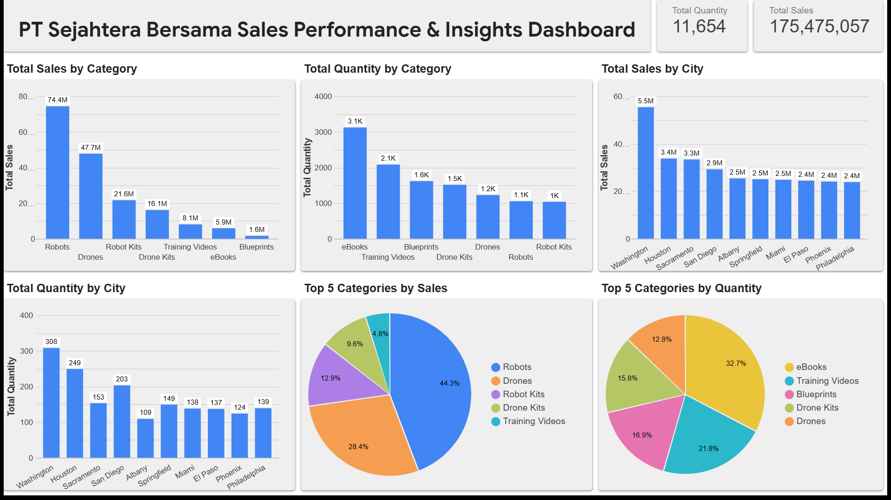
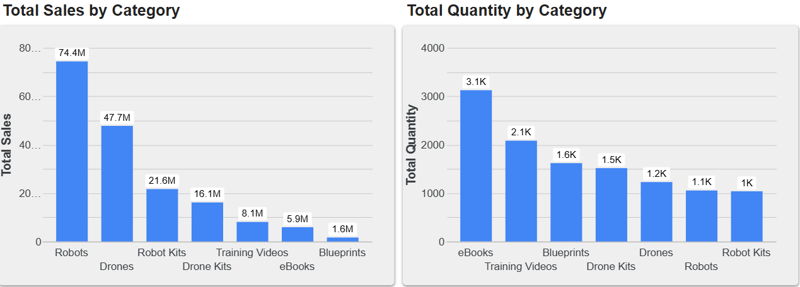
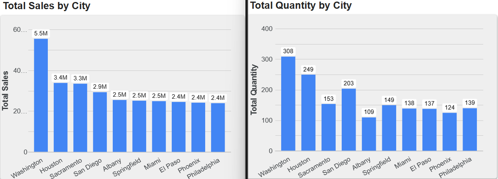

# 📊 Digital User Churn & Sales Performance Dashboard
### Business Intelligence Capstone Project | Rakamin Academy x Bank Muamalat

## 👋 Overview
Welcome to my portfolio project for the **Bank Muamalat Virtual Internship Program**. 

As a Business Intelligence Analyst candidate, I was tasked with transforming raw transactional data for **PT Sejahtera Bersama** into actionable strategic insights. This project demonstrates my end-to-end capability in data engineering, visualization, and business strategy.

I successfully designed a data pipeline using **Google BigQuery** to clean and join complex datasets, built an interactive dashboard in **Looker Studio**, and derived key recommendations that resulted in identifying a **175M+ revenue opportunity** through product bundling and regional optimization.

---

## 🛠️ Technology Stack
I utilized a modern cloud-based BI stack to ensure scalability and real-time analysis:
*   **Data Warehousing:** Google BigQuery (for storing and querying large datasets).
*   **Data Transformation:** Standard SQL (for joining tables and calculating metrics).
*   **Visualization:** Google Looker Studio (for interactive dashboarding and storytelling).
*   **Data Source:** Raw CSV exports from MS Access (as per project initial data).

## 🗄️ Data Model Architecture
To ensure data accuracy, I designed a **Star Schema** connecting four normalized tables. This structure prevents data duplication and allows for efficient aggregation.

*   **Fact Table:** `Orders` (Contains transactional metrics: Quantity, Date).
*   **Dimension Tables:**
    *   `Customers`: Linked via `CustomerID` (Provides geographic and contact context).
    *   `Products`: Linked via `ProdNumber` (Provides product details and pricing).
    *   `ProductCategory`: Linked via `CategoryID` (Provides hierarchical grouping).

**Key Relationships:**
> `Orders` (Many) ↔ `Customers` (One)  
> `Orders` (Many) ↔ `Products` (One)  
> `Products` (Many) ↔ `ProductCategory` (One)

---

## 💡 Key Business Insights
After analyzing the processed data, two critical patterns emerged that define our current business health:

### 📈 High-Level KPIs
| Metric | Value |
| :--- | :--- |
| **Total Sales Revenue** | **IDR 175,475,057** |
| **Total Units Sold** | **11,654** |

### 🔍 The "Volume vs. Value" Paradox
My analysis revealed a distinct disconnect between what customers buy frequently versus what generates revenue:
*   **Revenue Drivers:** **Robots** dominate revenue, contributing **44.3%** of total sales (~74.4M), despite having low unit volume.
*   **Volume Drivers:** **eBooks** drive traffic, accounting for **32.7%** of total quantity sold, yet contribute minimally to overall revenue.
*   **Geographic Leader:** **Washington** is our top-performing market, generating ~5.5M in sales (significantly higher than Houston or Sacramento).

---

## 🚀 Strategic Recommendations (Question 5)
Based on these findings, I propose the following three strategies to increase sales and optimize margins for PT Sejahtera Bersama:

### 1. Implement "Path-to-Pro" Product Bundling
*   **Strategy:** Create bundled SKUs pairing high-volume entry products with high-margin hardware.
*   **Action:** Launch a **"Robot Starter Kit"** (Robot + Training Video + Blueprint) at a slight discount.
*   **Goal:** Leverage the high traffic of eBooks to upsell customers into the high-margin Robot category, increasing Average Order Value (AOV).

### 2. Replicate the "Washington Model"
*   **Strategy:** Audit the successful sales tactics used in Washington (our top city) and replicate them in underperforming major markets.
*   **Action:** Allocate marketing budget to test Washington-specific campaigns in **Houston** and **Sacramento**.
*   **Goal:** Normalize performance across top-tier cities and unlock latent demand in secondary markets.

### 3. Price Optimization for High-Demand Low-Cost Items
*   **Strategy:** Test price elasticity on high-volume, low-revenue items.
*   **Action:** Increase the price of **Blueprints** by 10-15%.
*   **Goal:** Since volume is healthy (Top 3 in quantity) but revenue is low, a marginal price increase could significantly boost margins without deterring buyers.

---

## 📸 Dashboard Preview
Below are key snapshots from the interactive Looker Studio dashboard built for this project. 
*(Click the link below to view the live, interactive version)*

### [🔗 View Live Dashboard Here](https://lookerstudio.google.com/reporting/2425933c-c491-4c00-a0a2-65e9b6b5d07a)

*Figure 1: Executive Overview showing Total Sales (175.5M) and Total Quantity (11.6K).*

*Figure 2: The "Volume vs. Value" analysis highlighting the dominance of Robots in revenue and eBooks in volume.*

*Figure 3: Regional performance showing Washington as the top-performing market.*

---

## 📂 Project Deliverables
*   **Final Submission PDF:** [Download FinalTask_BankMuamalat_BI Analyst.pdf](submission/FinalTask_BankMuamalat_BI%20Analyst.pdf)
*   **SQL Query Source:** [View `query_master_sales.sql`](sql/query_master_sales.sql)

---

## 🤝 Connect With Me
I am actively seeking opportunities as a Business Intelligence Analyst. If you found this project interesting, let's connect!

*   **Email:** setyonugrohodwibudi@gmail.com
*   **Website:** www.budinugroho.com 

---